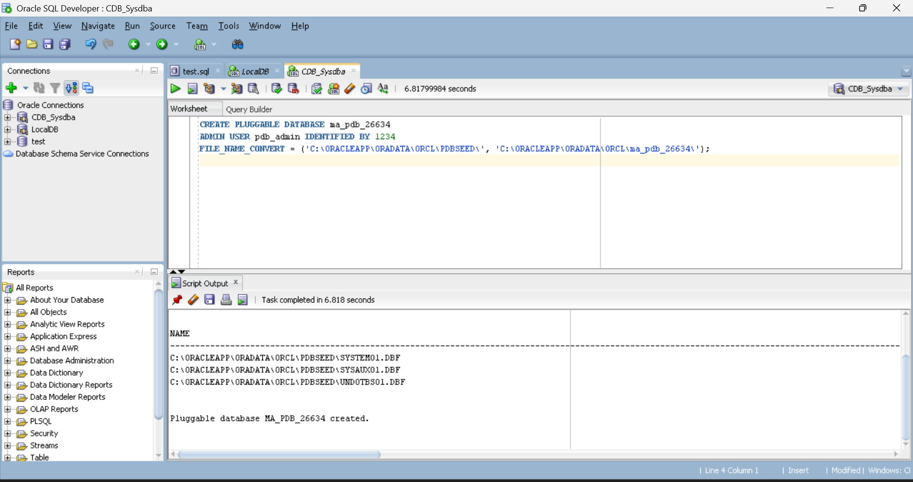
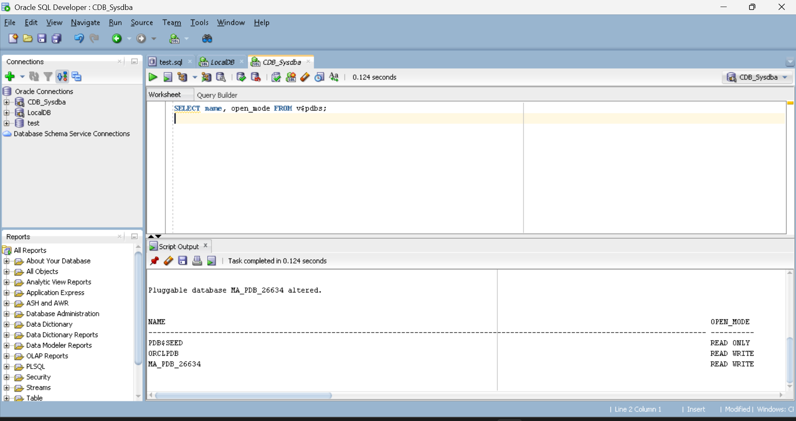
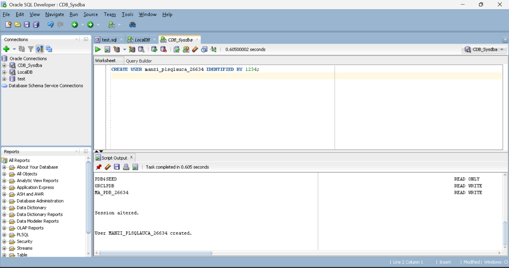
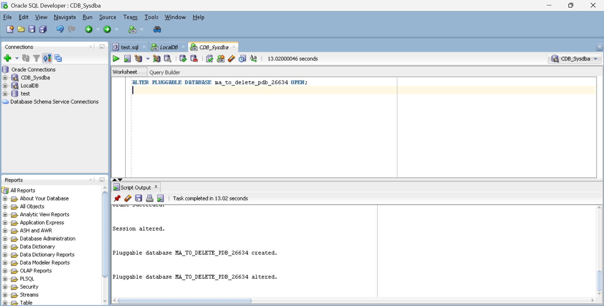
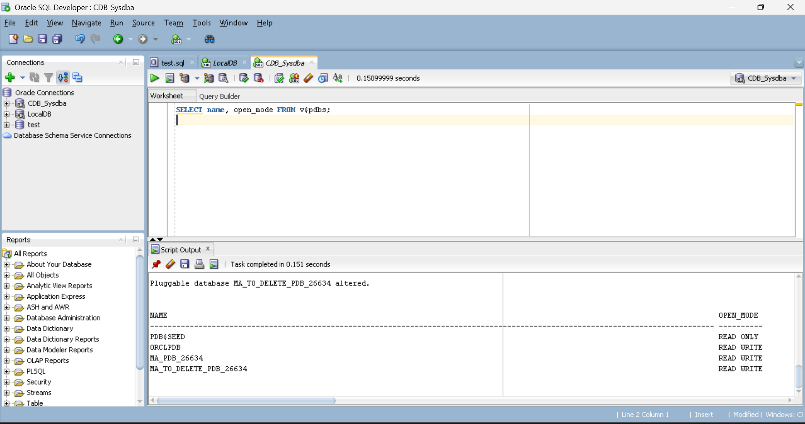
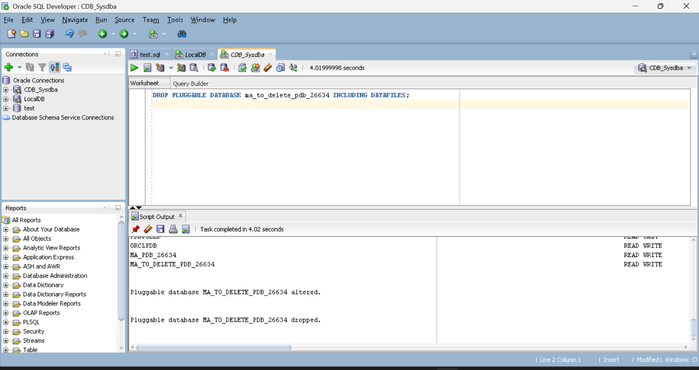
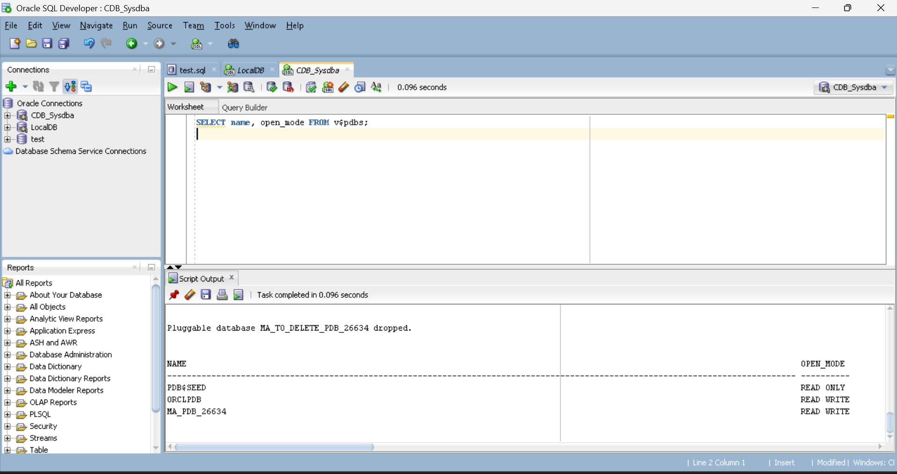
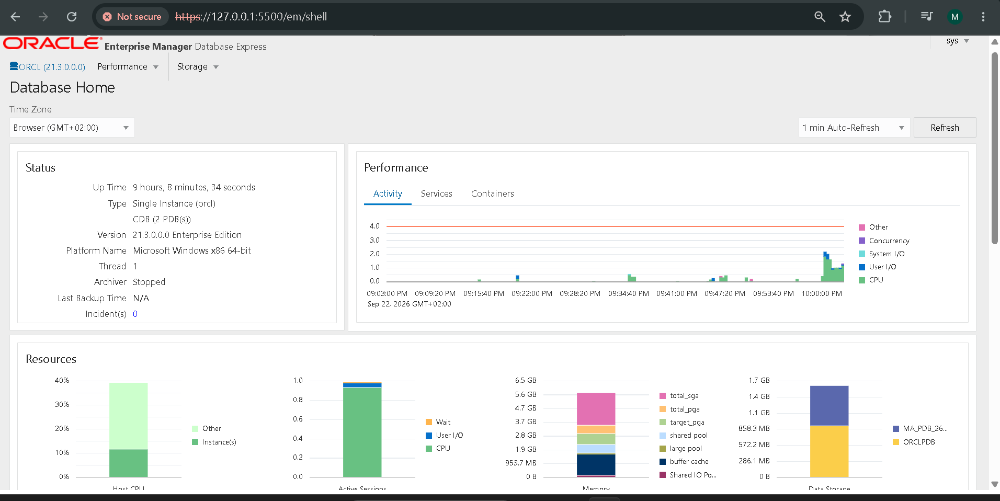
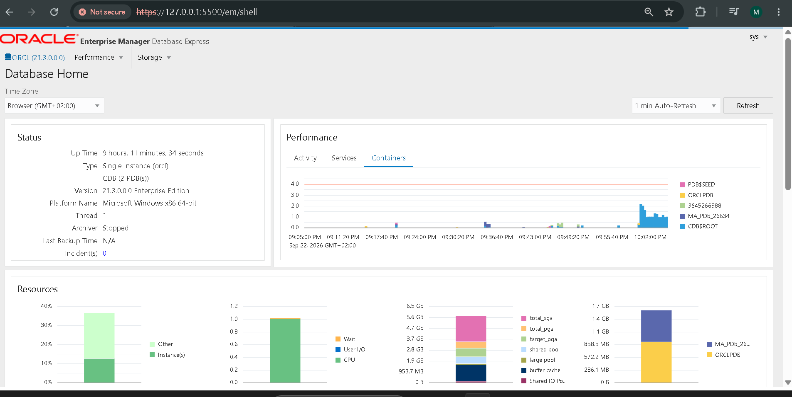

# Oracle Pluggable Database Management - Assignment II

**Student:** Manzi Fred  
**Student ID:** 26634  
**Course:** Database Development with PL/SQL (INSY 8311)  
**Instructor:** Eric Maniraguha  
**Date:** September 22, 2026  

---

## Oracle Environment

- Oracle Database 21c Enterprise Edition (21.3.0.0.0)
- CDB Name: ORCL
- Platform: Microsoft Windows x86 64-bit
- Tool used: Oracle SQL Developer (connected as CDB_Sysdba)
- OEM: Oracle Enterprise Manager Database Express

---

## Overview of Tasks

This assignment involved working with Oracle Multitenant Architecture by creating and managing Pluggable Databases (PDBs) inside a Container Database (ORCL). Four tasks were completed in total — creating a permanent PDB, creating and deleting a temporary PDB, verifying everything through Oracle Enterprise Manager, and documenting the work here on GitHub.

---

## Task 1 - Create a New Pluggable Database

PDB Name: `ma_pdb_26634`  
User Created: `manzi_plsqlauca_26634`  
Privileges: CONNECT, RESOURCE, DBA

I started from the CDB root connected as SYSDBA. First confirmed the seed path, then ran the CREATE PLUGGABLE DATABASE command using FILE_NAME_CONVERT to map the seed files to the new PDB location. After creation I opened it with ALTER PLUGGABLE DATABASE and verified it showed READ WRITE in v$pdbs. Then I switched the session into the PDB and created the user.

**PDB Created:**

**PDB Opened - READ WRITE confirmed:**

**User manzi_plsqlauca_26634 created inside PDB:**

---

## Task 2 - Create and Delete a Temporary PDB

Temporary PDB Name: `ma_to_delete_pdb_26634`

Created the temporary PDB the same way as Task 1, opened it and verified it appeared as READ WRITE in v$pdbs alongside ma_pdb_26634. Then closed it using CLOSE IMMEDIATE and dropped it completely with INCLUDING DATAFILES. A final SELECT on v$pdbs confirmed it was gone — only PDB$SEED, ORCLPDB and ma_pdb_26634 remained.

**Temporary PDB Created and Opened:**

**Both PDBs visible before deletion:**

**PDB Dropped - confirmation:**

**Final verification - temp PDB gone:**

---

## Task 3 - Oracle Enterprise Manager (OEM)

Accessed Oracle Enterprise Manager Database Express at https://127.0.0.1:5500/em, logged in as sys with SYSDBA role. The dashboard confirmed the CDB ORCL running Oracle 21.3.0.0.0 Enterprise Edition with 2 active PDBs. MA_PDB_26634 was visible in both the storage section and the Containers tab. Username sys was visible at the top right corner.

**OEM Dashboard:**

**OEM Containers Tab showing all PDBs:**

---

## Challenges Faced

During Task 3, Chrome blocked the OEM page with a certificate warning because OEM uses a self-signed certificate. I clicked Advanced and proceeded through the warning. There was also a browser popup appearing over the login form each time — I had to cancel it and fill the actual OEM form underneath. That resolved the login issue.

For the PDB creation, I had to first verify the actual datafile path since my Oracle installation used `C:\ORACLEAPP\ORADATA\ORCL\` instead of the standard `C:\app\` path. I queried v$datafile to confirm the correct path before running the CREATE command.

---

